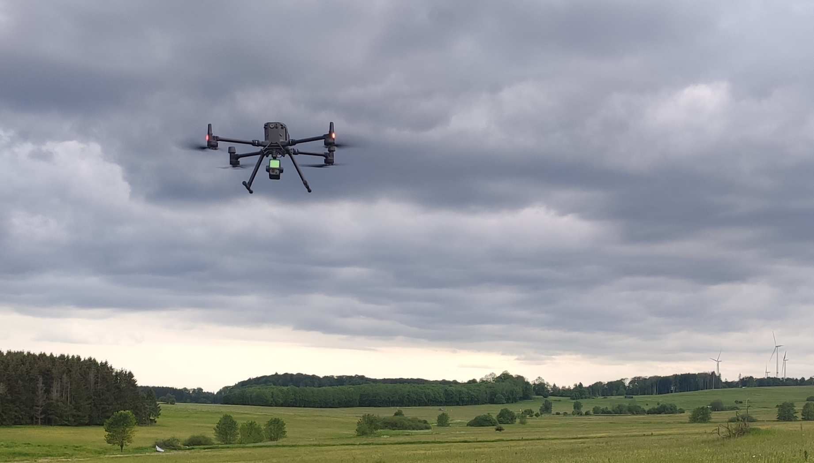

```{r setup, include=FALSE}
knitr::opts_chunk$set(echo = TRUE)
```
### What is LiDAR?
LiDAR is an abbreviation for "Light Detection and Ranging" and describes a special 
type of sensor which uses laser beams to measure distances of objects to a sensor. 
Sensors are typically equipped to ground based stations, drones or airplanes and 
produce three dimensional point clouds. It is widely used in forestry but also 
other kinds of ecological research with a focus on the structure of objects or landscapes.

```{r picture, echo=FALSE}

```

Here is a drone equipped with a LiDAR sensor (the little box under the drone), 
which was used to collect the data used in this workshop. 


### How can LiDAR be analysed?
There are two packages which are mainly used for analysing LiDAR data in R.

"lidR" and "lasR". lasR is based on the functions of lidR but combines it into 
pipelines which can be used to analyse large amounts of data with only few lines of code.
This makes lasR more efficient but lidR allows for more convenient manipulation of 
point clouds which is sometimes needed for complex tasks. 

Both packages have great tutorials which exceeds what we can cover in this workshop:

* https://r-lidar.github.io/lidRbook/index.html

* https://r-lidar.github.io/lasR/articles/tutorial.html


### Installing the packages
lasR is currently not available on CRAN and has to be externally installed. 
```{r install packages, warning = FALSE}
#install.packages('lasR', repos = 'https://r-lidar.r-universe.dev')
library(lasR)
#install.packages("lidR")
library(lidR)
```

for some further steps, we also install terra and sf

```{r install packages 2, message = FALSE, warning = FALSE}
#install.packages("terra")
library(terra)
#install.packages("sf")
library(sf)
library(ggplot2)
```

## Tree inventory using lidR

LiDAR data is increasingly used in forestry and we want to try some steps of 
performing a tree inventory for an example plots from the Harz mountains. 


Data can be downloaded via this link: https://uni-muenster.sciebo.de/s/m9iKBprxHdYQRKQ 
(pw: yomos2026)

### first steps / reading the data

Point clouds from a LiDAR sensor are saved as a .las file and can be directly loaded 
into an R environment using the function 'readLAS()'

```{r read lidR, warning=FALSE, message=FALSE, results='hide'}
trees <- readLAS("data/lidR/2023-08-30_15-19-13_100pct_height.laz")
```
We want to crop our point cloud and reduce the point cloud density to accelerate 
further analyses. Then we plot our point cloud. 
```{r plot trees}
trees_clip <- clip_rectangle(trees, -60, 20, -20, 60)
trees_dec <- decimate_points(trees_clip, algorithm = random(500))
plot(trees_dec)
```

### calculating pixel metrics

We now have thousands (or millions) of points with X,Y and Z coordinates. 
Therefore we can compute some basic statistics with them. Here we calculate the mean
height for our point cloud on a 1 m raster but we could come up with various 
functions if needed. 
```{r statistics, warning=FALSE, message=FALSE}
meanz <- pixel_metrics(trees_dec, func = ~mean(Z), res= 1)
plot(meanz)
```


### plotting transects

For visualisation we can plot transects through our point cloud. 

```{r transects, message=FALSE, warning=FALSE}
trees_tr <- clip_transect(trees_dec, c(-40,20) ,c(-40,60) , width = 4, xz = TRUE)
ggplot(trees_tr@data, aes(X,Z, color = Z)) + 
  geom_point(size = 0.5) + 
  coord_equal() + 
  theme_minimal() +
  scale_color_gradientn(colours = height.colors(50))
```

### forest inventory calculations

To start our small forest inventory, we produce a canopy height model 

```{r chm, warning=FALSE}
col <- height.colors(25)

chm <- rasterize_canopy(trees_clip, res = 0.5, p2r())
plot(chm, col = col)
```

Then we want to identify the tree tops to delienate all trees.

```{r tt, warning = FALSE}
ttops <- locate_trees(trees_dec, lmf(ws = 3))
chmdec <- rasterize_canopy(trees_dec, res = 0.5, p2r())

plot(chmdec, col = height.colors(50))
plot(sf::st_geometry(ttops), add = TRUE, pch = 3)

x <- plot(trees_dec, bg = "white", size = 4)
add_treetops3d(x, ttops)

```

And based on the tree tops, we can segment all trees using one of two algorithms.
```{r segment trees, message = FALSE, results='hide'}
algo <- dalponte2016(chmdec, ttops)
algo <- li2012()

# we want to decrease the resolution even more to reduce processing time+
trees_dec <- decimate_points(trees_clip, algorithm = random(50))
trees_seg <- segment_trees(trees_dec, algo) # segment point cloud
plot(trees_seg, bg = "white", size = 4, color = "treeID") # visualize trees

# Now we can look at single trees from our dataset
tree <- filter_poi(trees_seg, treeID == 5)
plot(tree, size = 8, bg = "white")
```

### calculating woody biomass

An important part of tree inventories is to calculate the biomass of wood on a
specific area. Using custom metrics we try to get a broad assumption of biomass 
for our segmented trees. Then we aggregate the biomass on a raster and calculate
it for the entire area.

```{r biomass, warning=FALSE}
custom_crown_metrics <- function(z, i) { # user-defined function
  metrics <- list(
    z_max = max(z),   # max height
    z_sd = sd(z),     # vertical variability of points
    i_mean = mean(i), # mean intensity
    i_max  = max(i)   # max intensity
  )
  return(metrics) # output
}


metrics <- crown_metrics(trees_seg, func = ~custom_crown_metrics(Z, Intensity)) # calculate intensity metrics
metrics$G <- 0.7 * metrics$z_max + 0.1 * metrics$i_mean # set value of interest
plot(metrics["G"], pal = hcl.colors, pch = 19) # some plotting

r <- terra::rast(ext(trees_seg),  resolution = 10)
v <- terra::vect(metrics["G"])
map <- terra::rasterize(v, r, field = "G", fun = sum) # extract sum of G at 10m
plot(map, col = hcl.colors(15)) # some plotting


# calculating overall biomass based on the raster
biomass <- sum(values(map)) # Biomass on 40 x 40 meter
biomass <- biomass / 16     # Biomass on 10 x 10 meter
biomass <- biomass * 100    # Biomass per ha
biomass                     # 260581.3 ? 
                            # 260 tonns ? 
```


## Trying out lasR 

Now we want to perform some simple analysis using the lasR package for comparison. 

### Our example dataset

Our test data is from a study in hesse, which analysed breeding sites of whinchats
and how structures from breeding and non-breeding sites differed. 
First of all we load a shortened metadata file which includes coordinates of our
example point cloud. 
```{r metadata}
data <- read.csv2("data/lasR/metadata.csv")
```


### First steps with lidR

Point clouds from a LiDAR sensor are saved as a .las file and can be directly loaded 
into an R environment using the function 'readLAS()'
```{r lidR read, message= FALSE, results = "hide"}
las <- readLAS("data/lasR/driedorf_1.las")
las
str(las)
```

Our .las file is still quite big (2.7 GB) but there are simple ways to manipulate 
point clouds and therefore reduce processing power needed for our first analyses.

We can reduce the resolution of our point cloud.
```{r decimate points}
reduced <- decimate_points(las, random(20))
reduced
```
And we clip our data to a circle of 60 meter using our coordinates from the metadata file

```{r clip}
clipped <- clip_circle(reduced, data$Lon[1], data$Lat[1], 60)
```

Our reduced point cloud can then simply be plotted for a first look. 
```{r plot point cloud, message = FALSE}
plot(clipped, color = "RGB")
```

We write out our reduced point cloud for further use. 
```{r write point cloud}
writeLAS(clipped,"data/lasR/driedorf_1_reduced.las")
```

If already done we can read the new point cloud from our data folder. 
```{r read and plot}
las_reduced <- readLAS("data/lasR/driedorf_1_reduced.las")
plot(las_reduced, color = "RGB")
```


### First steps with lasR
lasR works a bit different than lidR and does not process data directly in the 
R Environment. We can create so called pipelines which can be applied on our files
in a directory. This is especially useful for larger amounts of data. 

First of all we need to define a file path to our data. 
```{r file path}
path <- list.files("data/lasR/", pattern = ".las", full.names = TRUE, recursive = TRUE)
path

# we only want a single file for now
f <- path[2]
```

The first step of processing most lidar data is a triangulation. Various algorithms 
can be applied to create some kind of net from our point cloud. Using this we 
can for example produce digital terrain models. 

We produce a short pipeline which combines reading an las file and then triangulating 
the ground points. Then we execute the pipeline on the file in our filepath.
```{r triangulate, eval = FALSE }
pipeline = reader() + triangulate(filter = keep_ground(), ofile = tempgpkg())
ans = exec(pipeline, on = f)
ans
```

However we produce 'nothing' because lasR itself does not save data in our environment. 
We have to include certain steps in our pipeline like 'write_las'.

In our next try, we again perform a triangulation, but include two additional functions,
which write out our ground points and a normalised point cloud. 

```{r ground and normalise}
write1 = write_las(paste0("data/lasR/*_ground.las"), filter = keep_ground())
write2 = write_las(paste0("data/lasR/*_normalized.las"), )
del = triangulate(filter = keep_ground())
norm = transform_with(del, "-")
pipeline =  write1 + del + norm + write2
ans = exec(pipeline, on = f)
ans
```
Now we can take a look at our newly produced data. 
```{r plot ground}
path <- list.files("data/lasR/", pattern = ".las", full.names = TRUE, recursive = TRUE)

ground <- readLAS(path[3])
plot(ground, color = "RGB")

normalise <- readLAS(path[4])
plot(normalise, color = "RGB")
```
For some use cases we need raster data, which we can get if we change our pipeline
and add the 'rasterize' function. 

```{r rasterise, warning = FALSE}
del = triangulate(filter = keep_ground())
dtm = lasR::rasterize(res = 1)
pipeline = del + dtm
ans = exec(pipeline, on = f)
plot(ans)
```


### Answering ecological questions with LiDAR data

Now we want to focus on problems which might occur during a forest monitoring 
(Our example dataset is not from a forest, but the functions are the same). 

We want to detect local maxima in our dataset and through this delineate single trees.
To start, we produce a raster from our normalised point cloud and then use
'local maximum raster()' and 'region_growing()' to detect the trees. 


```{r tree detection, warning=FALSE}
del = triangulate(filter = keep_first())
chm = lasR::rasterize(0.5, del)
chm2 = pit_fill(chm)
seed = local_maximum_raster(chm2, min_height = 3, ws = 7)
tree = region_growing(chm2, seed)
pipeline = del + chm + chm2 +  seed + tree
ans = exec(pipeline, on = path[4])

col = grDevices::colorRampPalette(c("blue", "cyan2", "yellow", "red"))(25)
col2 = grDevices::colorRampPalette(c("purple", "blue", "cyan2", "yellow", "red", "green"))(50)
terra::plot(ans$rasterize, col = col, mar = c(1, 1, 1, 3))
terra::plot(ans$pit_fill, col = col, mar = c(1, 1, 1, 3))
terra::plot(ans$region_growing, col = col2[sample.int(50, 277, TRUE)], mar = c(1, 1, 1, 3))
plot(ans$local_maximum$geom, add = T, pch = 19, cex = 0.5)

ans$local_maximum
```


### point cloud calculations

We can also perform simple calculations with point clouds to get mean or maximum 
heights. 

We have to define functions, which can then be integrated into our pipeline. 

```{r functions}
meanz = function(data){ return(mean(data$Z)) }
sdz = function(data){ return(sd(data$Z)) }
maxz = function(data){ return(max(data$Z)) }
```

Calculating the mean height
```{r mean height}
call = callback(meanz, expose = "xyz")
pipeline <- call 
ans <- exec(pipeline, on = path[4])    
ans 
```
Standard deviation of height
```{r sd height}
call = callback(sdz, expose = "xyz")
pipeline <- call 
ans <- exec(pipeline, on = path[4])    
ans 
```
Or maximum height
```{r}
call = callback(maxz, expose = "xyz")
pipeline <- call 
ans <- exec(pipeline, on = path[4])    
ans
```


