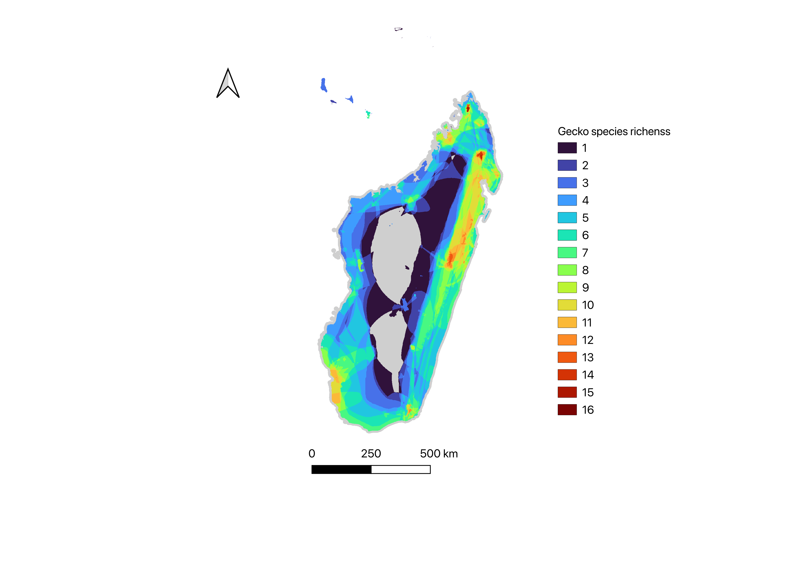

## What we will do

-   show the geographic distribution (and richness) of species

-   create species richness maps for a discrete trait

-   create an average map for a continuous trait

-   extract climate variables for the distribution are of a species

## Data we use

::: incremental
-   Spatial Data: Species distributions as polygons from [GARD 1.7](https://datadryad.org/dataset/doi:10.5061/dryad.9cnp5hqmb)
    -   here we only use a subset of the original dataset of some geckos species present in Madagascar
-   Trait Data: A table with all kinds of traits on reptiles from [RepTraits](https://figshare.com/articles/dataset/ReptTraits_a_comprehensive_database_of_ecological_traits_in_reptiles/24572683) version 1.2
    -   here we only use the traits "activity" and "max_SVL" for the geckos species
-   Climate Data: variable bio 1 (mean annual temperature) averages from 1981 - 2010 version 2.1 from [CHELSA](https://www.chelsa-climate.org/datasets/chelsa_bioclim)
:::

## R code

------------------------------------------------------------------------

### packages we need

```{r}
# install.packages(c("terra", "sf", "exactextractr"))
library(terra)
library(exactextractr)
library(sf)
```

------------------------------------------------------------------------

### getting data ready

------------------------------------------------------------------------

#### loading the traits table

```{r}
gecko_traits <- read.csv("../data/gecko_data/Madagaskar_Gecko_Traits.csv")
head(gecko_traits)
```

------------------------------------------------------------------------

#### loading the spatial data (species distributions polygons)

```{r}
shp_gecko <- read_sf("../data/gecko_data/Madagaskar_geckos_GARD1.7.shp")
# vect("../data/gecko_data/Madagaskar_geckos_GARD1.7.shp") is also an option
head(shp_gecko)
```

------------------------------------------------------------------------

#### loading the climate raster (annual mean temperature)

```{r}
bio1 <- rast("../data/gecko_data/bio1_Madagaskar.tif")
plot(bio1)
```

------------------------------------------------------------------------

### a basic species richness map

```{r}
shp.a <- shp_gecko[1,] #subset for the first species of the list
richness <- rasterize(shp.a, bio1) # use bio1 raster as a mask layer to rasterize
richness[is.na(richness)] <- 0 # set NAs to 0 for calculations

# for loop to add all species together in one richness raster
for (i in 2:nrow(shp_gecko)){
  shp.i<- shp_gecko[i,]
  rast.i<- rasterize(shp.i, bio1)
  rast.i[is.na(rast.i)] <- 0
  richness <- (rast.i + richness)
}
richness[richness == 0] <- NA # return 0 to NAs
writeRaster(richness, "../data/gecko_data/gecko_sp_richness_Madagascar.tif", overwrite=T) # save for later
plot(richness)
```

------------------------------------------------------------------------

Using the saved .tif file, you can make nice visualizations of the map with softwares like QGIS or ArcGIS

```{r, echo=FALSE}
#| label: madagaskar map
#| fig-align: center
#| fig-cap: "QGIS map of gecko species richness in Madagaskar"

```

------

### species richness map per trait (discrete)

```{r}
# activity Nocturnal
activity.noc <- subset(gecko_traits, gecko_traits$Activity == "Nocturnal")
head(activity.noc)
shp.a <- subset(shp_gecko, shp_gecko$binomial == "Paroedura androyensis") #subset for the first species of the list
richness_noc<- rasterize(shp.a, bio1) 
richness_noc[is.na(richness_noc)] <- 0 

for (i in 2:length(activity.noc$Species)){
  shp.i<- subset(shp_gecko, shp_gecko$binomial == activity.noc$Species[i])
  rast.i<- rasterize(shp.i, bio1)
  rast.i[is.na(rast.i)] <- 0
  richness_noc<- (rast.i + richness_noc)
}
richness_noc[richness_noc == 0] <- NA
plot(richness_noc)
writeRaster(richness_noc, "../data/gecko_data/richness_nocturnal_madagaskar.tif", overwrite=T)

# activity Diurnal
activity.diu <- subset(gecko_traits, gecko_traits$Activity == "Diurnal")
head(activity.diu)
shp.a <- subset(shp_gecko, shp_gecko$binomial == "Lygodactylus arnoulti") #subset for the first species of the list
richness_diu <- rasterize(shp.a, bio1) 
richness_diu[is.na(richness_diu)] <- 0 

for (i in 2:length(activity.diu$Species)){
  shp.i<- subset(shp_gecko, shp_gecko$binomial == activity.diu$Species[i])
  rast.i<- rasterize(shp.i, bio1)
  rast.i[is.na(rast.i)] <- 0
  richness_diu<- (rast.i + richness_diu)
}
richness_diu[richness_diu == 0] <- NA
plot(richness_diu)
writeRaster(richness_diu, "../data/gecko_data/richness_diurnal_madagaskar.tif", overwrite=T)
```

### a map to see the average of a continuous trait

```{r}
shp.a <- shp_gecko[1,]
rast.i<- rasterize(shp.a, bio1)
rast.i[is.na(rast.i)] <- 0
SVL.i <- max(gecko_traits$max_SVL[1])
richness_SVL <- classify(rast.i, cbind(1, SVL.i))

for (i in 2:nrow(shp_gecko)){
  shp.i <- shp_gecko[i,]
  rast.i<- rasterize(shp.i, bio1)
  rast.i[is.na(rast.i)] <- 0
	SVL.i <- max(gecko_traits$max_SVL[i])
	rast.i <- classify(rast.i, cbind(1, SVL.i))
	richness_SVL<- (rast.i + richness_SVL)
}
richness_SVL[richness_SVL == 0] <- NA
plot(richness_SVL)

overall_richness <- rast("../data/gecko_data/gecko_sp_richness_Madagascar.tif")
average_SVL <- richness_SVL/overall_richness
plot(average_SVL)
```

### extract climate data

```{r}
# combine CHELSA data with distribution data
res_complete <- c()
for (i in 1:length(shp_gecko)) {
  shp.i <- shp_gecko[i,]
  clim.i <- exact_extract(bio1, shp.i, c("stdev", "median")) #extracting the standard deviation and the median of all four CHELSA variables
  res.i <- cbind(shp.i$binomial, clim.i)
  colnames(res.i) <- c("Species", "stdev_bio1", "median_bio")
  res_complete <- rbind(res_complete, res.i)
} 
head(res_complete)
write.csv(res_complete, "../data/gecko_data/CHELSA_madagaskar_gecko.csv")
```
